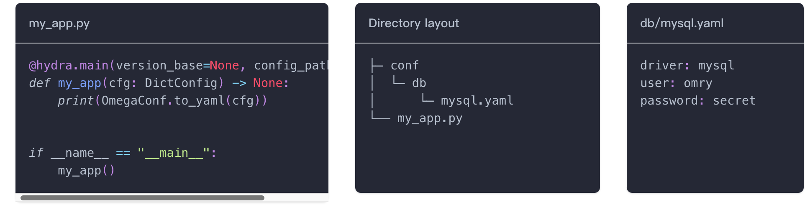

# Structured Configs Tutorial
## Introduction
Structured Configs 使用Python `dataclass` 来描述config配置的结构
See the [OmegaConf docs on Structured Configs](https://omegaconf.readthedocs.io/en/latest/structured_config.html) for more details.

Hydra 有两种重要的场景用到**Structured Configs**
1. As a config, in place of configuration files (often a starting place)
2. As a config schema validating configuration files (better for complex use cases)

Hydra通过 `ConfigStore` API来支持 OmegaConf's Structured Configs

## ConfigStore API
### ConfigStore and YAML input configs
ConfigStore can be used alone or together with YAML. 

我们使用下面的config group来举例说明



思考我们如何在`db`中添加 `postresql`配置？
除了在db文件夹下添加postresql.yaml文件之外，我们可以使用`ConfigStore`去添加另一个配置。

```shell
$ python 3.1_config_store.py +db=postgresql

db:
  driver: postgresql
  user: jieru
  password: secret
```

注意上面的代码, 因为我们没有给db默认值, 因此我们要添加default list需要使用+前缀


### Example node values
```python
from dataclasses import dataclass

from hydra.core.config_store import ConfigStore

@dataclass
class MySQLConfig:
    host: str = "localhost"
    port: int = 3306

cs = ConfigStore.instance()

# Using the type
cs.store(name="config1", node=MySQLConfig)
# Using an instance, overriding some default values
cs.store(name="config2", node=MySQLConfig(host="test.db", port=3307))
# Using a dictionary, forfeiting runtime type safety
cs.store(name="config3", node={"host": "localhost", "port": 3308})
```

## Minimal example
```shell
$ python 3.3_minimal_example.py +pok=34

host: localhost
port: 3306
pok: 34
```

从上面的代码示例来看, 使用`ConfigStore` API可以完全替代掉 `config.yaml`

## A hierarchical static configuration
这节主要编写了详细的代码说明`ConfigStore` API可以完全替代掉 `config.yaml`
```shell
$ python 3.4_static_config.py ui.title=ley

Title=ley, size=1024x768 pixels
```

## Config Group
这节展示如何使用 `ConfigStore`接口实现 config group功能
```shell
$ python 3.5_config_groups.py +db=mysql
db:
  driver: mysql
  host: localhost
  port: 3306
```

> 注意: 这里db没有默认设置, 因此要添加db配置需要使用+db=sql前缀


## Defaults List
这一节介绍了如何在 `ConfigStore`api中实现default list的配置, 总体来说比较麻烦, 没有直接使用yaml文件配置那么好用&灵活。
[Defaults List](https://hydra.cc/docs/tutorials/structured_config/defaults/)