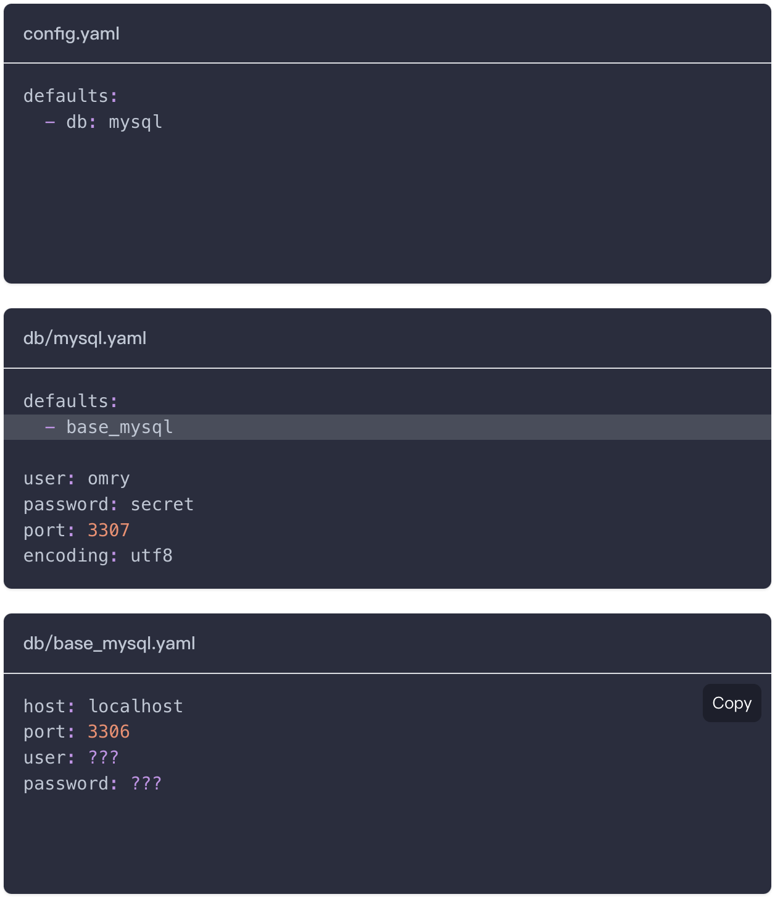
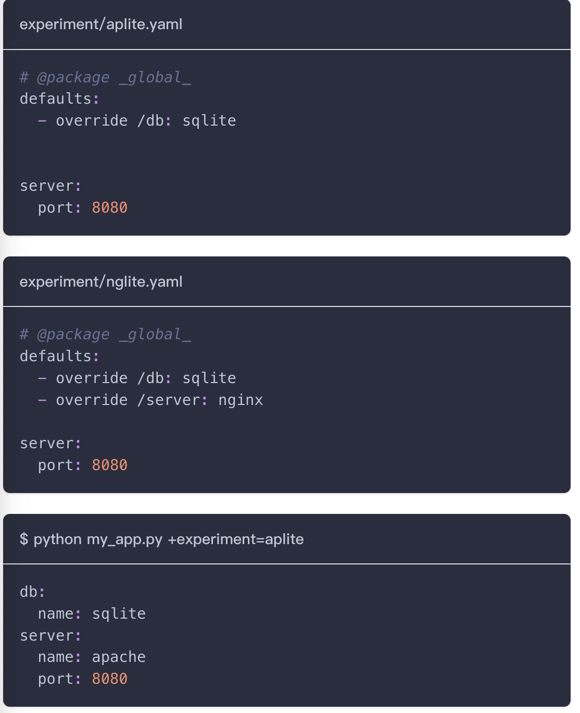
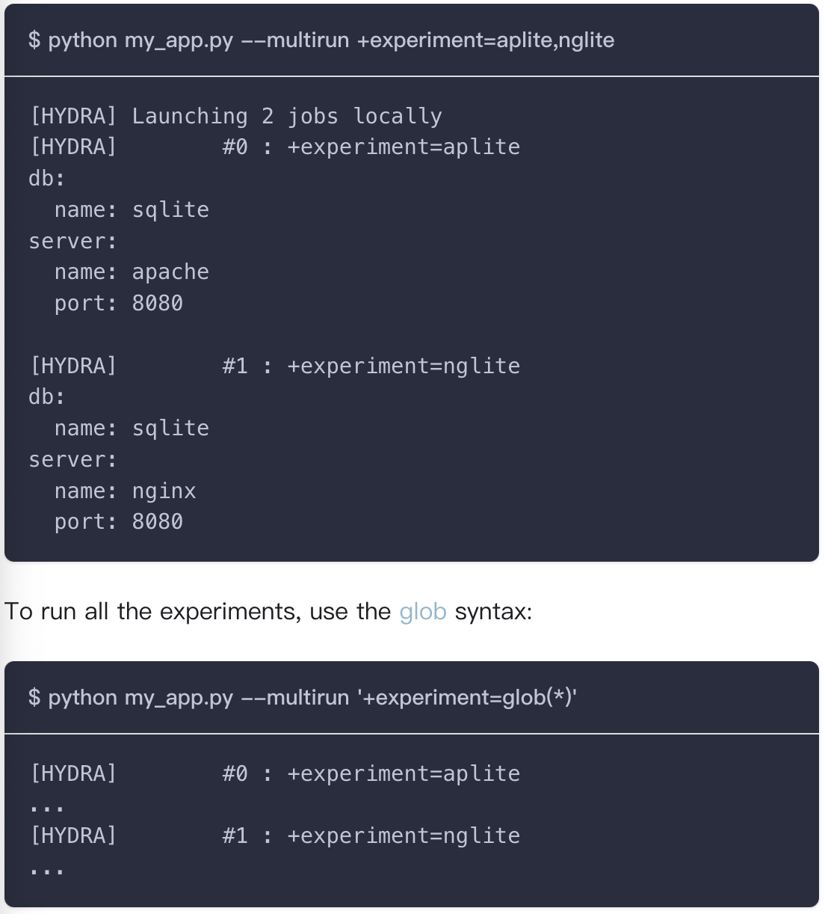
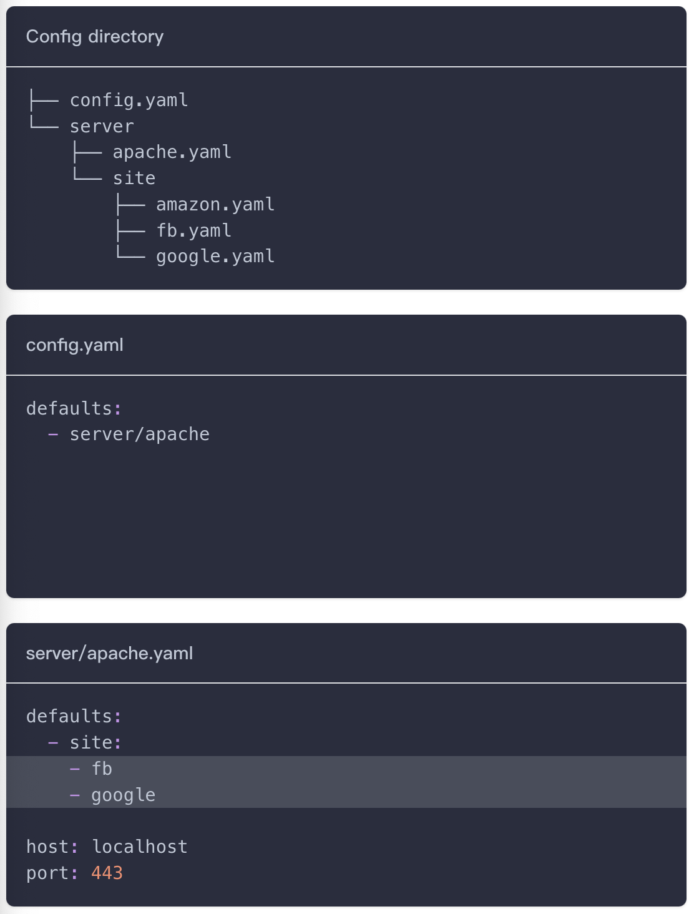
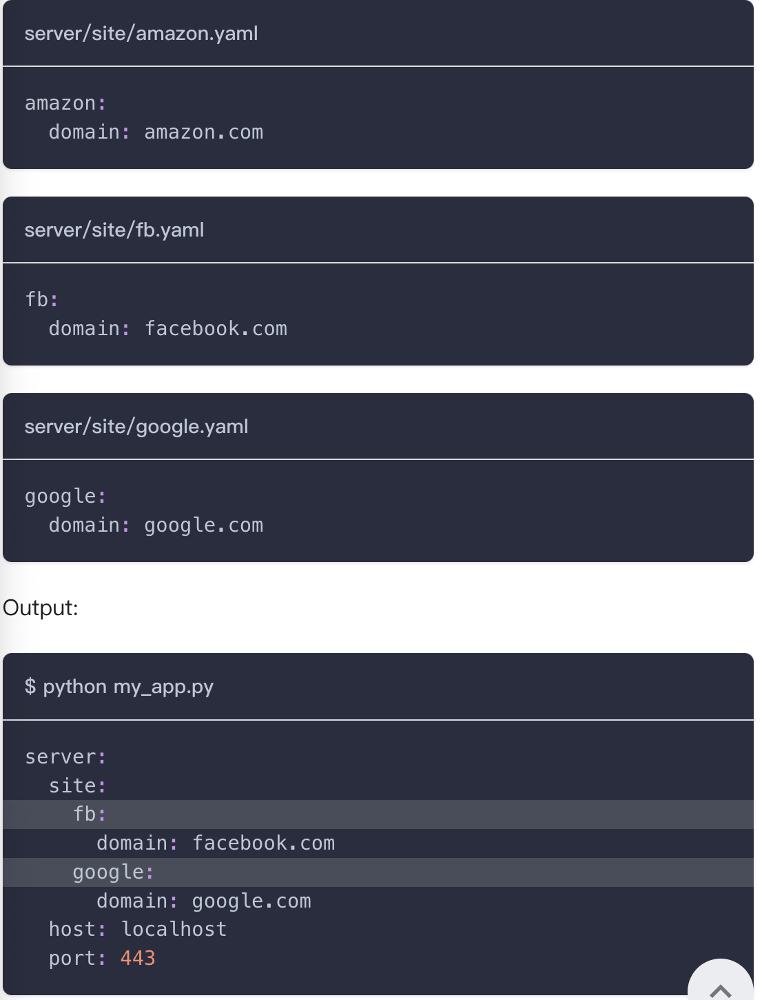
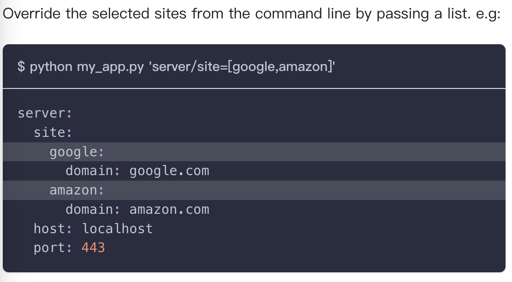

# Common Patterns
## Extending Configs
这节介绍如何扩展现有的配置，在包含基本配置的基础上覆盖/添加新的值。

1. 从相同的config group中扩展配置
    参考下图的配置, 两个yaml文件都是属于`db`组

    

    Output:
    ```shell
    $ python my_app.py

    db:
    host: localhost   # from db/base_mysql
    port: 3307        # overridden by db/mysql.yaml 
    user: omry        # populated by db/mysql.yaml
    password: secret  # populated by db/mysql.yaml
    encoding: utf8    # added by db/mysql.yaml
    ```
    可以看到base_mysql.yaml中的基础配置会被mysql.yaml中的配置覆盖

2. 从别的config group中扩展配置
   To extend a config from a different config group, include it using an absolute path (/), and override the package to _here_. (_here_ is described in Packages)

    ```yaml
    # db/mysql.yaml
    defaults:
    - /db_schema/base_mysql@_here_
    ```


## Configuring Experiments
本节主要解决实验跨维度配置参数的问题, 举个例子如下:
```text
├── config.yaml
├── db
│   ├── mysql.yaml
│   └── sqlite.yaml
└── server
    ├── apache.yaml
    └── nginx.yaml
```
现在我想做两组实验, exp1使用mysql&nginx配置, exp2使用sqlite&apache配置。如果按照常规方法的话, 我们就需要在命令行中添加很多的参数, 非常的不方便。
Hydra的解决方法是可以配置实验组的参数, 然后在命令使用override的方式覆盖掉default的参数。


> 注意: override中需要是绝对路径



## Configuring Plugins
感觉用不上, 先过了

## Selecting multiple configs from a Config Group
在某些情况下，可能需要从同一个配置组中选择多个配置。





## Specializing configuration
这节解决以下问题：配置中的某些参数随一些选择固定。
例如：使用alexnet时, 当数据集时cifar10时layer参数为5, 默认为7
**初始的的配置**
```yaml
defaults:
  - dataset: imagenet
  - model: alexnet
```
使用上面的配置无法实现当dataset=cifar10时,model.layer=5

因此我们修改原始的config.yaml
```yaml
defaults:
  - dataset: imagenet
  - model: alexnet
  - optional dataset_model: ${dataset}_${model}
```

**optional**
By default, Hydra fails with an error if a config specified in the defaults does not exist. In this case we only want to specialize cifar10 + alexnet, not all 4 combinations. the keyword optional tells Hydra to just continue if it can't find this file.

我们需要创建一个dataset_model文件夹, 并在其中建立一个cifar10_alexnet.yaml
```yaml
# @package _global_

model:
  num_layers: 5
```

## Read-only config
让config变成只读

```python
@dataclass(frozen=True)
class SerialPort:
    baud_rate: int = 19200
    data_bits: int = 8
    stop_bits: int = 1


cs = ConfigStore.instance()
cs.store(name="config", node=SerialPort)


@hydra.main(version_base=None, config_name="config")
def my_app(cfg: SerialPort) -> None:
    print(cfg)


if __name__ == "__main__":
    my_app()
```